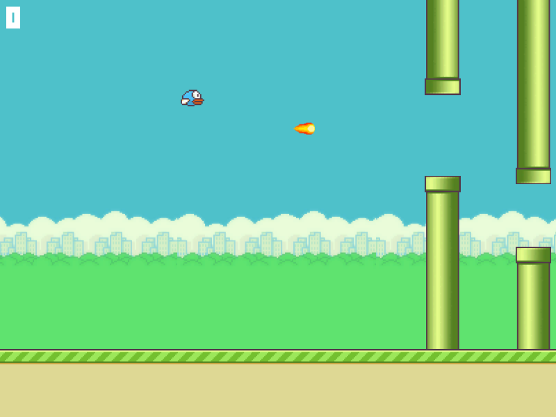

## Flappy Bird

A submission for a Game Programming course in [DILo Game Academy](https://academy.dilo.id/)

### Screenshot

## Download

See [releases](/releases/latest)

### License

The projects are licensed under [Apache 2.0 License](LICENSE), but not for the assets because the fonts, sounds, and sprites was given in the course.

If you are the owner of the assets and you'd like to take it down, you can reach me by email (My email address is available in my profile). 
